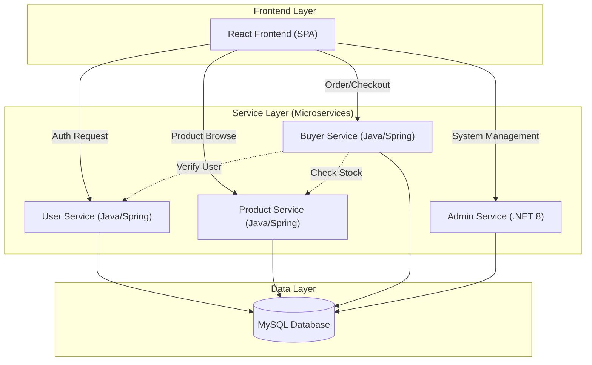

# GreenCart: Project Presentation & Architecture Guide

GreenCart is a microservices-based E-commerce platform designed to bridge the gap between farmers and buyers. It provides a decentralized marketplace where farmers can sell their produce directly to customers, managed by a robust administrative system.

---

## 🏗️ Architecture Overview

The project follows a **Microservices Architecture**, where different business capabilities are split into independent services. This allows for polyglot programming (using different languages for different needs) and independent scalability.

### 🧩 Core Services

| Service Name | Tech Stack | Responsibility |
| :--- | :--- | :--- |
| **User Service** | Java + Spring Boot | Manages Authentication (JWT), User Profiles (Admin, Farmer, Buyer), and Role Mangement. |
| **Product Service** | Java + Spring Boot | Handles Product Catalog, Categories, Sub-categories, and Stock management. |
| **Buyer Service** | Java + Spring Boot | Manages Shopping Cart, Order Placement, and Payments. |
| **Admin Service** | .NET 8 (C#) | Provides Administrative Control, Reporting, and Overall System Orchestration. |

### 🛠️ Technology Stack

- **Frontend**: React.js with Redux Toolkit for state management, Axios for API calls, and React Router for navigation.
- **Backend**: Spring Boot (Java 21) and ASP.NET Core (.NET 8).
- **Database**: MySQL (Centralized database `greencartdb` shared/split across services).
- **Security**: JWT (JSON Web Tokens) for stateless authentication.

---

## 📊 Architecture Diagram

The following diagram illustrates the interaction between the frontend and the various microservices.

---

## 🚀 Development Flow

The development process for GreenCart follows a standard Agile-SDLC approach:

1.  **Requirement Analysis**: Detailed SRS (Software Requirement Specification) was prepared to identify user roles (Admin, Farmer, Buyer).
2.  **Database Design**: A normalized schema was designed in MySQL (`greencartdb_New.sql`) to ensure data integrity.
3.  **Backend Development**:
    *   **Spring Boot Services**: Developed using Maven, JPA/Hibernate for ORM, and REST APIs.
    *   **.NET Admin Service**: Built using Entity Framework Core for data access.
4.  **Frontend Development**: Built using a component-based architecture in React, integrating with backend APIs via Axios.
5.  **Integration**: Services communicate via REST APIs, and JWT is used to secure the endpoints.
6.  **Testing & Deployment**: Individual modules are tested (JUnit for Java, XUnit for .NET) before being integrated.

---

## 📈 Key Features for Presentation

- **Role-Based Access Control (RBAC)**: Secure access for different user types.
- **Microservices Orchestration**: Independent services working together.
- **Interoperability**: Seamless integration between Java and .NET services.
- **Direct Marketplace**: Eliminating middlemen by connecting farmers directly to buyers.
